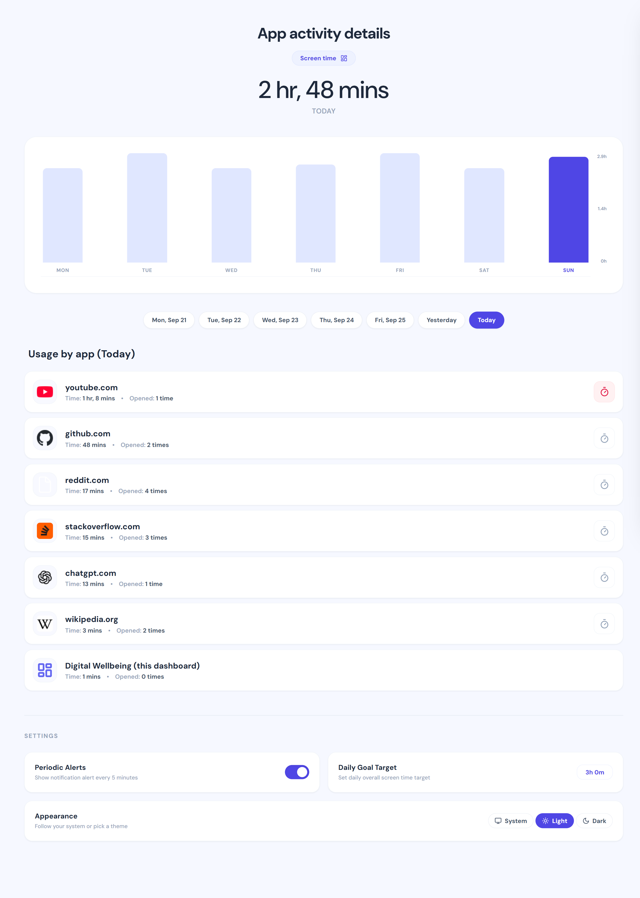
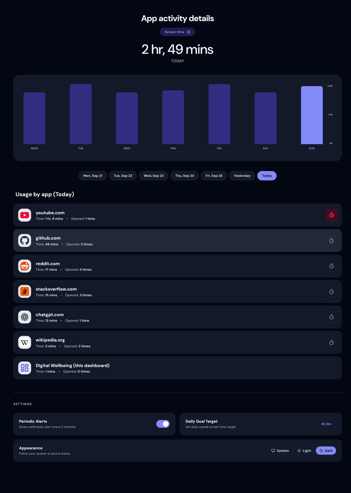
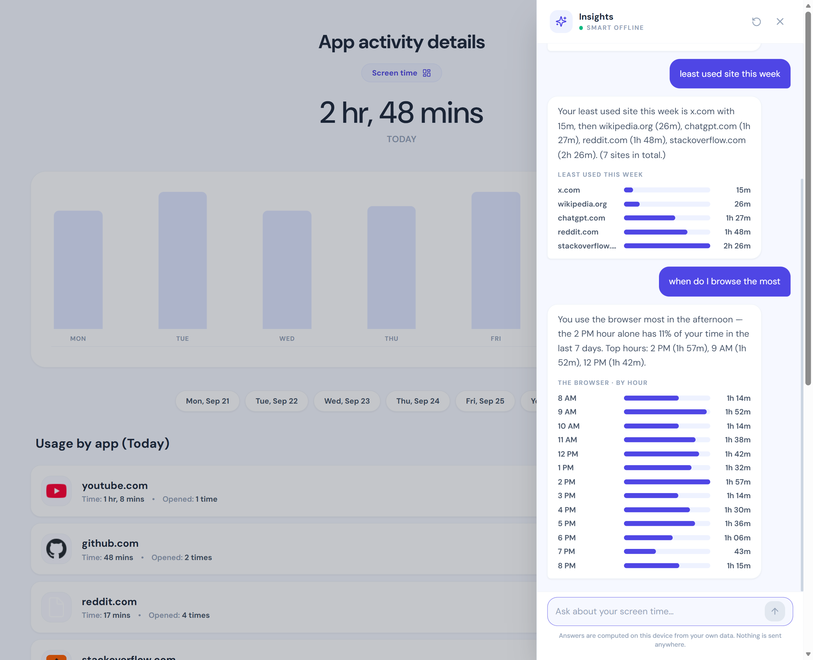
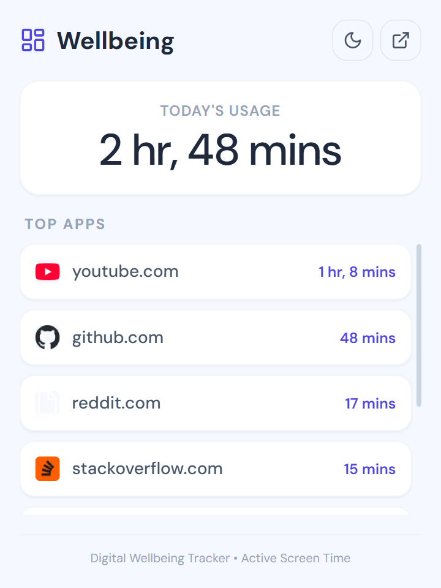
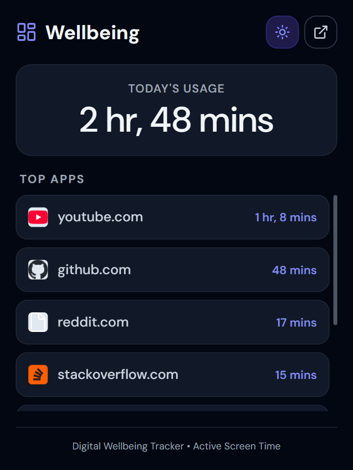
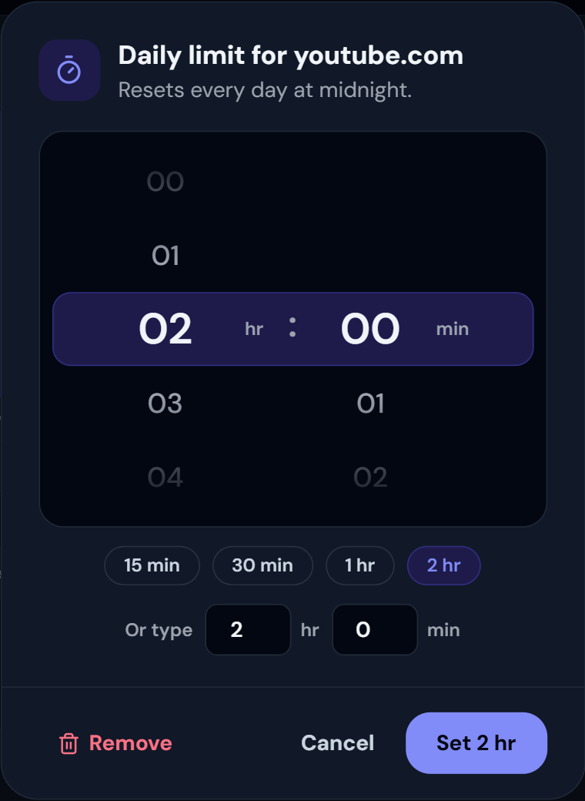
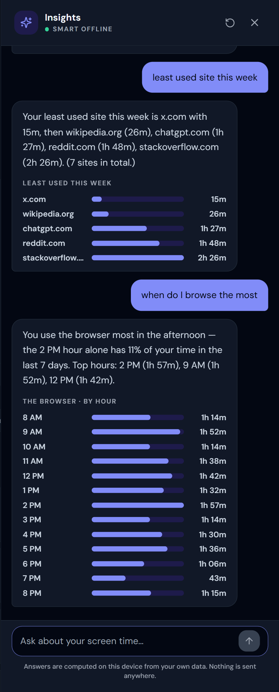

# Digital Wellbeing Tracker — Browser Extension

A beautiful, responsive, and feature-rich browser extension inspired by Android's Digital Wellbeing. It helps you monitor your daily screen time, manage website usage, and stay productive through custom daily limits and periodic alerts.

## 📸 Screenshots

<p align="center">
  
  
</p>

<p align="center">
  
</p>

| Popup (light) | Popup (dark) | Timer dialog | Chat (dark) |
| :---: | :---: | :---: | :---: |
|  |  |  |  |

---

## 🚀 Key Features

* **Real-time Screen Time Tracking:** Monitors active browsing time down to the second using smart visibility sensors and focus-state heartbeats.
* **Dual-Mode Visual Dashboard:**
  * **Compact Popup View:** Click the extension icon in the toolbar to see today's overall screen time and your top-used domains. Fits perfectly on a `360px` mobile layout.
  * **Full-Page Tab View:** Click the dashboard link to view a wide-screen details page containing a responsive 7-day custom bar graph, interactive date selection pills, and granular site settings.
* **Insights Chat:** Ask questions about your own usage in plain language ("least used site this week", "when do I browse the most") and get exact, on-device answers with small charts. See [Insights Chat](#-insights-chat-ask-questions-about-your-usage).
* **Light & Dark Theme:** Follows your system or your pick, across the popup, dashboard and chat.
* **Custom App Limits & Site Blocking:** Set daily time limits for any website with a wheel picker, quick picks or typed entry. Once your limit is reached, a custom warning overlay pauses the page and restricts access until the next day.
* **Periodic Alert Notches:** An unobtrusive, animated drop-down notification slides into view every 5 minutes of continuous domain usage, keeping you conscious of your time.
* **Reliable Date-Based Metrics:** Saves metrics grouped by local calendar date (`YYYY-MM-DD`), preventing system clock shifts from corrupting your tracking history. Includes an auto-migration script for legacy schemas.
* **Local Developer Fallback:** Includes a full mock fallback for `chrome.storage` and `chrome.runtime` namespaces. Run the project in any standard browser to preview the interface with gorgeous pre-populated mock data.

---

## 💬 Insights Chat (ask questions about your usage)

Open the full dashboard and click **Ask** to chat with your own data: *"average time on youtube this week"*, *"how many times did I open github in the past 7 days"*, *"least used site"*, *"when do I browse the most"*, *"compare this week vs last week"*, *"did I stay under my goal"*. Short follow-ups work too (*"and yesterday?"*, *"what about reddit?"*).

* **Numbers come from code, never from a model.** A question is turned into a structured query (site, period, metric), `src/utils/stats.ts` computes the exact answer from `chrome.storage.local`, and a template phrases it. Answers can include a small bar chart.
* **Zero cost, works offline, nothing leaves your device.** Understanding runs on-device in three tiers: a keyword parser (instant), Chrome's built-in Gemini Nano when the machine supports it, and a small sentence-embedding model (`all-MiniLM-L6-v2`, ~23 MB, downloaded once on first use and cached by the browser, CPU only). The only network request the chat ever makes is that one-time model download.
* **Session log.** Besides daily totals, the background worker now records visits as `sessions:YYYY-MM-DD` tuples (`[domain, start, seconds]`), which powers time-of-day, longest-session and accurate visit-count answers. Sessions are kept for 90 days, daily totals for 365.
* **Scope.** The extension only sees browser tabs, so questions about desktop apps or your phone get a polite "I can't see that".

To refresh the classifier after editing the example phrasings in `src/chat/intents.ts`, run `npx tsx scripts/build-intent-embeddings.ts` (it also prints accuracy on a held-out question set).

## 🌗 Light & dark theme

The popup, dashboard and chat share one theme. Pick **System / Light / Dark** in the dashboard's *Appearance* card (default follows your OS), or use the sun/moon button in the popup. Colours are semantic tokens (see `design.md`), applied before first paint so nothing flashes.

---

## 🛠️ Built With

* **Frontend:** React 18, TypeScript, Tailwind CSS 3
* **Icons:** Lucide React
* **On-device AI:** `@huggingface/transformers` (ONNX Runtime Web, WASM/CPU) for the chat's sentence-embedding classifier, plus Chrome's Prompt API (Gemini Nano) where available
* **Tests:** Vitest (`npm test`)
* **Build System:** Vite 5, PostCSS, Autoprefixer
* **Extension Platform:** Web Extension Manifest V3 (compatible with Chrome, Edge, Brave, Opera, etc.), Background Service Workers, and injected Content Scripts

---

## ⬇️ Install (no build needed)

1. Download **`digital-wellbeing-extension.zip`** from the [latest release](https://github.com/Manan005/Digital-Wellbeing-Desktop---Web-Extension/releases/latest).
2. Extract it. You get a folder named **`digital-wellbeing-extension`** with `manifest.json` inside.
3. Open `chrome://extensions` (Edge: `edge://extensions`), turn on **Developer mode**, click **Load unpacked**, and select that `digital-wellbeing-extension` folder.
4. Pin **Digital Wellbeing Tracker** from the puzzle-piece menu in the toolbar.

Keep the folder where it is: the browser loads the extension from it. To update, download the new zip, replace the folder, and click the reload icon on the extension's card.

Works in Chrome, Edge, Brave, Opera and other Chromium browsers. **Firefox** isn't supported yet; see [docs/firefox-plan.md](docs/firefox-plan.md).

---

## 📦 Build from Source

Follow these steps to build the extension yourself (for development, or to load your own changes).

### 1. Build the Extension Locally

1. **Prerequisites:** Ensure you have [Node.js](https://nodejs.org/) 20 or newer installed.
2. **Clone the repository:**
   ```bash
   git clone https://github.com/Manan005/Digital-Wellbeing-Desktop---Web-Extension.git
   cd Digital-Wellbeing-Desktop---Web-Extension
   ```
3. **Install packages:**
   ```bash
   npm install
   ```
4. **Build the extension:**
   ```bash
   npm run build
   ```
   *Note: This command compiles TypeScript/JSX and uses Vite to bundle the files into a new `dist/` directory at the project root.*

---

### 2. Load the Extension into Your Browser

Once the `dist/` folder is generated, load it into your preferred web browser:

1. Open any Chromium-based web browser (such as **Google Chrome, Microsoft Edge, Brave, Opera, or Vivaldi**).
2. Go to the extensions management screen by typing the appropriate URL in the address bar:
   * **Chrome / Brave:** `chrome://extensions`
   * **Edge:** `edge://extensions`
   * **Opera:** `opera://extensions`
3. Turn on **Developer mode** (typically a toggle switch in the top-right corner or sidebar).
4. Click the **Load unpacked** button (sometimes called **Load unpacked extension**).
5. Select the **`dist`** folder in your project directory.
6. Pin the **Digital Wellbeing Tracker** to your toolbar for quick access (via the extensions puzzle piece icon in your toolbar).

---

### 3. Applying Code Updates

If you modify any source files (in `src/`):
1. Run `npm run build` again to recompile the changes.
2. Go back to your browser's extensions page and click the **Reload icon** (circular arrow button) on the **Digital Wellbeing Tracker** extension card.

---

### 4. Publishing a Release

Releases are built by GitHub Actions ([.github/workflows/release.yml](.github/workflows/release.yml)); the `dist/` folder is never committed.

1. Bump `"version"` in `manifest.json` (for example to `1.1.0`) and commit.
2. Push a matching tag: `git tag v1.1.0 && git push origin v1.1.0`.
3. The workflow runs the tests, builds, and attaches `digital-wellbeing-extension.zip` to the `v1.1.0` release (creating it if needed). It stops with an error if the tag and the manifest version don't match.

To rebuild the zip for an existing tag, open **Actions → Release → Run workflow** and enter the tag.

---

## 💻 Development Workflow

* **Start local development server:**
  ```bash
  npm run dev
  ```
  Open the displayed localhost URL. The application automatically detects that it is running outside of an extension context and injects simulated storage/metrics APIs to populate the charts.
* **Compile and validate production build:**
  ```bash
  npm run build
  ```
